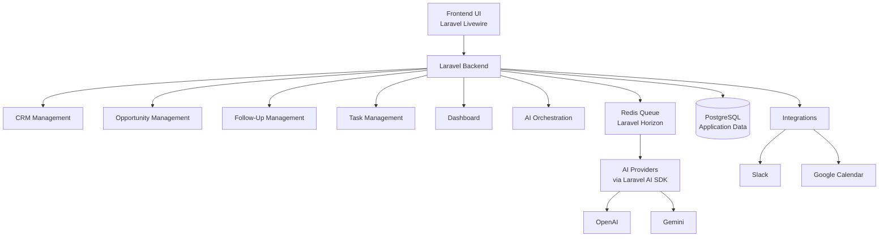
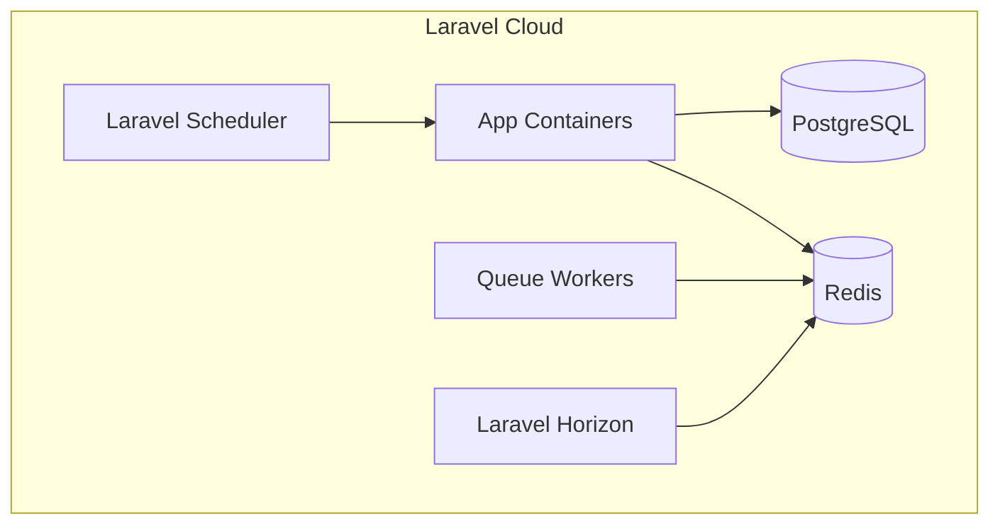

# High Level Design (HLD)

## Project

Internal AI-Assisted CRM Platform

## Date

2026-05-27

---

# 1. Overview

This document describes the high-level architecture for an internal AI-assisted CRM platform focused on:

- Lead generation
- Opportunity management
- Sales pipeline tracking
- Follow-up automation
- AI-assisted prospecting and qualification

The platform prioritizes:

- Operational simplicity
- AI-assisted workflows
- Lightweight CRM functionality
- Internal usage
- Automation-first processes

This HLD is based on the approved PRD.

---

# 2. Technology Stack

## Backend
- Laravel 13

## Frontend
- Laravel Livewire

## Database
- PostgreSQL

## Queue System
- Redis Queue

## Queue Monitoring
- Laravel Horizon

## AI Layer
- Laravel AI SDK

## Infrastructure
- Docker (Laravel Sail)
- Laravel Cloud

---

# 3. System Architecture

## High-Level Components

---

# 4. Core Domains

## CRM Domain

Responsible for:

- Lead/client management
- Opportunity tracking
- Follow-up tracking
- Historical interaction data

### Main Entities

#### Lead / Client

Represents both prospects and customers.

Main attributes include:

- Company name
- Contact information
- Website
- Social links
- Lead source
- Qualification notes
- AI insights
- Opportunity history
- Follow-up history

---

#### Opportunity

Represents commercial opportunities.

Main attributes include:

- Opportunity title
- Pipeline stage
- Estimated value
- Status
- Proposal information
- Related lead/client
- AI recommendations

---

#### Follow-Up

Represents scheduled actions and reminders.

Main attributes include:

- Due date
- Priority
- Notes
- Related opportunity

---

# 5. Sales Pipeline

The initial pipeline is fixed and not dynamically configurable.

## Pipeline Stages

1. Lead
2. Qualification
3. Contact 
4. Proposal Generation
5. Proposal Analysis
6. Proposal Sent
7. Won
8. Lost

---

## Pipeline Behavior

### Lead
- Prospecting agent creates leads in this stage.

### Qualification
- Qualification agent analyzes leads.
- AI qualification process executes asynchronously.
- Lead is moved to the next stage after analysis.

### Contact
- Human-driven interaction stage.
- Conversations happen outside the platform.
- External AI chat agents may assist communication.

### Proposal Generation
- Proposal assistant agent is triggered.

### Proposal Analysis
- Human review stage.
- User analyzes proposal before sending to client.

### Proposal Sent
- Awaiting commercial outcome.

### Won
- Opportunity successfully closed.

### Lost
- Opportunity lost.

---

# 6. AI Architecture

## AI Layer

The platform uses Laravel AI SDK as the official AI abstraction layer.

Supported providers:

- OpenAI
- Gemini

Provider selection is configurable via environment configuration.

No automatic provider failover is included in the MVP.

---

## AI Orchestration Model

Architecture combines:

- Central AI orchestration service
- Responsibility-specific agents
- Event-driven orchestration
- Optional future job chaining

---

## AI Agents

### Prospecting Agent

Responsible for:

- Discovering leads
- Identifying business opportunities
- Finding companies with potential service needs

Characteristics:

- Operates similarly to a commission-driven outbound salesperson
- Uses public and free internet sources
- Prospecting strategy is intentionally unrestricted
- AI determines the best discovery approach

Possible starting sources include:

- Google Maps
- Instagram
- Facebook
- Business websites
- Local directories

The browsing/navigation strategy remains undefined in the MVP.

No assumptions are made regarding:

- Browser automation
- Crawling frameworks
- Scraping engines
- Specialized integrations

---

### Qualification Agent

Responsible for:

- Lead qualification
- Opportunity analysis
- Digital presence analysis
- Pain point identification
- CRM enrichment

Runs asynchronously through Redis queues.

---

### Recommendation Agent

Responsible for:

- Outreach suggestions
- Next-step recommendations
- Opportunity analysis
- AI-generated insights

---

### Proposal Assistant Agent

Responsible for:

- Proposal analysis assistance
- Commercial recommendation support

The proposal generation implementation remains undefined in the MVP.

No assumptions are made regarding:

- Proposal format
- PDF generation
- Template engines
- Electronic signature
- Export workflows

---

# 7. Queue and Workflow Architecture

## Queue System

The platform uses:

- Redis queues
- Laravel queue workers
- Laravel Horizon

---

## Scheduled Workflows

### Prospecting Workflow

Executed using Laravel Scheduled Commands.

Schedule:

- Weekdays at 08:00

Responsibilities:

- Trigger prospecting agents
- Start automated lead discovery

---

## Asynchronous Workflows

Executed using queued jobs.

Includes:

- Lead qualification
- AI analysis
- Recommendations
- Proposal assistance

---

## Stage-Based Automation

Pipeline stage changes may:

- Trigger AI jobs
- Create follow-ups
- Create tasks
- Send Slack notifications

Job chaining may be evaluated in the future but is not assumed in the MVP architecture.

---

# 8. Dashboard Architecture

The dashboard focuses on operational visibility.

## Dashboard Cards

- Leads created today
- Opportunities created today

---

## Dashboard Charts

Last 30 days:

- Leads per day
- Opportunities per day
- Sales per day

---

## Dashboard Tables

- Pending tasks
- Follow-ups

---

## Explicitly Out of Scope

The dashboard does not include:

- AI metrics
- Queue health
- Failed job monitoring
- AI cost tracking
- Agent observability
- Activity feeds

---

# 9. Integrations

## Slack Integration

Purpose:

- Operational notifications

Initial behavior:

- Single Slack channel
- Simple messages only

Examples:

- Pending follow-ups
- Important tasks
- Proposal reminders

Future possibilities may include:

- Interactive Slack actions
- Multiple channels

These are not included in the MVP.

---

## Google Calendar Integration

Purpose:

- Create events for:
  - Follow-ups
  - Important tasks

Architecture:

- Wrapper over Google Calendar API
- No internal calendar model
- No bidirectional synchronization

Initial setup:

- Single company calendar

---

## AI Provider Integration

Implemented through Laravel AI SDK abstraction.

Supported providers:

- OpenAI
- Gemini

Provider comparison and evaluation will occur during platform evolution.

---

# 10. Infrastructure Architecture

## Local Development

Uses:

- Docker
- Laravel Sail

---

## Cloud Deployment

Uses:

- Laravel Cloud

---

## Core Infrastructure Components

---

# 11. Authentication

## Authentication Model

- Multiple internal users
- Standard Laravel authentication

The HLD intentionally does not define:

- Authentication packages
- ACL/RBAC systems
- Multi-tenancy

---

# 12. Non-Functional Considerations

## Scalability

Architecture should support:

- Additional AI workflows
- Additional integrations
- Queue scaling
- Increased AI workload

---

## Maintainability

Architecture prioritizes:

- Simplicity
- Clear domain separation
- Modular AI responsibilities

---

## Reliability

Requirements include:

- Queue retries
- Isolation of external integration failures
- Non-blocking AI execution

---

## Observability

Minimal operational observability:

- Standard Laravel logs
- Laravel Horizon dashboard

No enterprise observability tooling is included.

---

# 13. Future Considerations

Potential future expansions:

- Gmail integration
- Project management
- Billing
- Financial modules
- Email automation
- Google Drive integration (if project management is introduced)
- SMS integration

These features are outside the MVP scope.

---

# 14. Architectural Principles

The platform architecture prioritizes:

- Simplicity over enterprise complexity
- AI-assisted operational workflows
- Async-first processing
- Human approval for commercial actions
- Lightweight internal tooling
- Modular AI orchestration

The system intentionally avoids premature abstraction and unnecessary enterprise patterns in the MVP stage.
