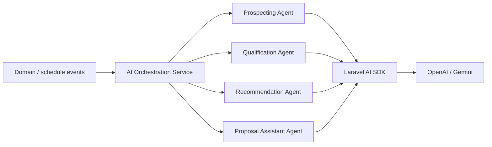

# ADR-003: AI orchestration architecture

## Status

Accepted

## Context

Multiple AI responsibilities exist (prospecting, qualification, recommendations, proposal assistance). The HLD requires modular agents, central orchestration, event-driven triggers, and optional future job chaining—not assumed in MVP.

## Decision

Implement a **central AI orchestration service** that:

1. Dispatches **responsibility-specific agents** (Prospecting, Qualification, Recommendation, Proposal Assistant).
2. Uses **event-driven orchestration** (domain events / listeners) to enqueue work.
3. Runs heavy AI work **asynchronously** via Redis queues (see [ADR-006](ADR-006-queue-async-processing.md)).
4. Does **not** assume job chaining in MVP; chaining may be evaluated later.

References:

- [HLD §6 AI Architecture](../02%20HLD.md#6-ai-architecture)
- [PRD AI Agents](../01%20PRD.md#ai-agents)

## Consequences

- **Positive:**
  - Clear separation of agent responsibilities; easier to test and extend.
  - Non-blocking UI; AI failures isolated from synchronous requests.
- **Negative:**
  - Orchestration layer adds indirection; must be kept simple per MVP principles.
- **Neutral:**
  - Stage-based automation (see feature 14) plugs into the same orchestration entry points.
