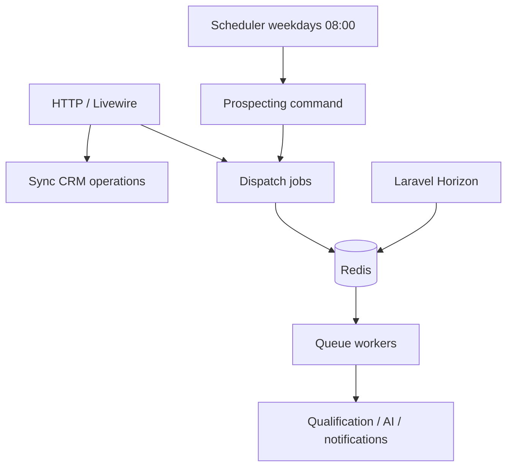

# ADR-006: Queue and async processing

## Status

Accepted

## Context

Lead qualification, AI analysis, recommendations, and proposal assistance must not block HTTP requests. The HLD requires Redis queues, Laravel workers, Horizon, queue retries, and non-blocking AI execution.

## Decision

- Use **Redis** as the queue backend.
- Run **Laravel queue workers** in all environments; **Horizon** for monitoring in deployed environments.
- Implement AI and integration side effects as **queued jobs** with Laravel’s retry semantics.
- **Scheduled** prospecting uses Laravel Scheduler (commands), not the queue scheduler alone.

References:

- [HLD §7 Queue and Workflow Architecture](../02%20HLD.md#7-queue-and-workflow-architecture)
- [PRD Non-Functional — Reliability](../01%20PRD.md#non-functional-requirements)

## Consequences

- **Positive:**
  - Resilient AI workloads; retries for transient failures.
  - Horizon gives minimal operational visibility without enterprise APM.
- **Negative:**
  - Requires Redis and workers in every environment; local Sail must include Redis service.
- **Neutral:**
  - Job chaining explicitly deferred (see [ADR-003](ADR-003-ai-orchestration-architecture.md)).
