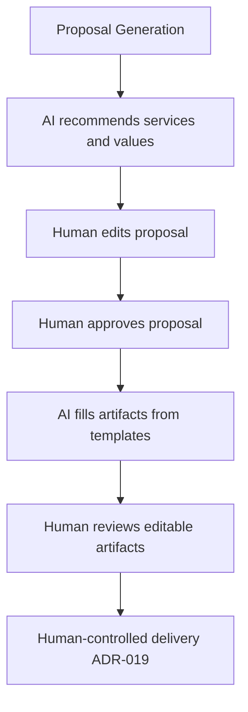

# ADR-018: Proposal domain, generation, and artifacts

## Status

Accepted (2026-08-14)

## Supersedes

[ADR-016](ADR-016-proposal-generation-undefined-mvp.md), which intentionally left proposal format, persistence, templates, PDF, and export undefined.

## Context

The product now requires a persisted commercial proposal tied to the opportunity, priced catalog line items, opportunity notes as AI context, human approval before artifact generation, browser editing where needed, and PDF export.

Human-controlled delivery is defined separately in [ADR-019](ADR-019-human-controlled-proposal-delivery.md). The catalog boundary is defined in [ADR-020](ADR-020-commercial-service-catalog-boundary.md).

## Decision

### Domain model

1. Store **one proposal per opportunity** in `proposals` (`opportunity_id` unique).
2. Proposal context combines client data, opportunity data, qualification insights, opportunity notes, and catalog-backed line items.
3. Proposal line items reference commercial services and may override unit price without changing the catalog default.
4. Store human approval metadata (approver and timestamp) on the proposal.
5. Regeneration overwrites the current draft/content on the same proposal; no proposal version history in MVP.

### Human + AI flow

- IA recommends services and values.
- Human edits and approves.
- IA generates commercial text, slide, and contract from fixed templates.
- Human reviews before any delivery.

### Templates

- Templates for commercial text, slide, and contract live as **fixed files in the repository** (for example Blade/HTML under a dedicated path). Changes ship via deploy; no admin template UI in MVP.

### Artifact matrix

| Artifact | Browser | PDF |
| -------- | ------- | --- |
| Commercial text | Editable in CRM | Yes |
| Slide deck summary | Not editable as a slide editor | Yes only |
| Contract | Editable in CRM | Yes |

### PDF generation

- PDFs are **generated on demand** from the current proposal content and templates.
- The database stores editable proposal content (and related fields), **not** a retained history of PDF binaries.
- Regenerating a PDF always reflects the latest approved/edited content.

### Explicitly out of MVP

- Electronic signature.
- PPTX/DOCX export (PDF and in-app HTML/text only).
- Persistent PDF file history or object-storage versioning of every render.
- Multiple concurrent proposals or proposal version history per opportunity.

## Consequences

- **Positive:**
  - Closes the intentional architecture gap in ADR-016.
  - Gives proposals a stable record and artifact contract.
  - Editable text/contract stay in the CRM record of truth.
- **Negative:**
  - On-demand PDF means slightly higher latency on download/send.
  - Template changes require a deploy.
  - Overwrite-on-regenerate does not preserve prior drafts.
- **Neutral:**
  - Long-running generation/render work uses queues and timeouts suitable for LLM + PDF latency ([ADR-006](ADR-006-queue-async-processing.md)).
  - Delivery remains governed by ADR-019.

## References

- [ADR-016 Superseded proposal gap](ADR-016-proposal-generation-undefined-mvp.md)
- [ADR-019 Human-controlled delivery](ADR-019-human-controlled-proposal-delivery.md)
- [ADR-020 Commercial catalog boundary](ADR-020-commercial-service-catalog-boundary.md)
- [FDR-013 Proposal assistance](../FDRs/ToDo/FDR-013-proposal-assistance.md)
- [FDR-020 Proposal artifacts and delivery](../FDRs/ToDo/FDR-020-proposal-artifacts-and-delivery.md)
