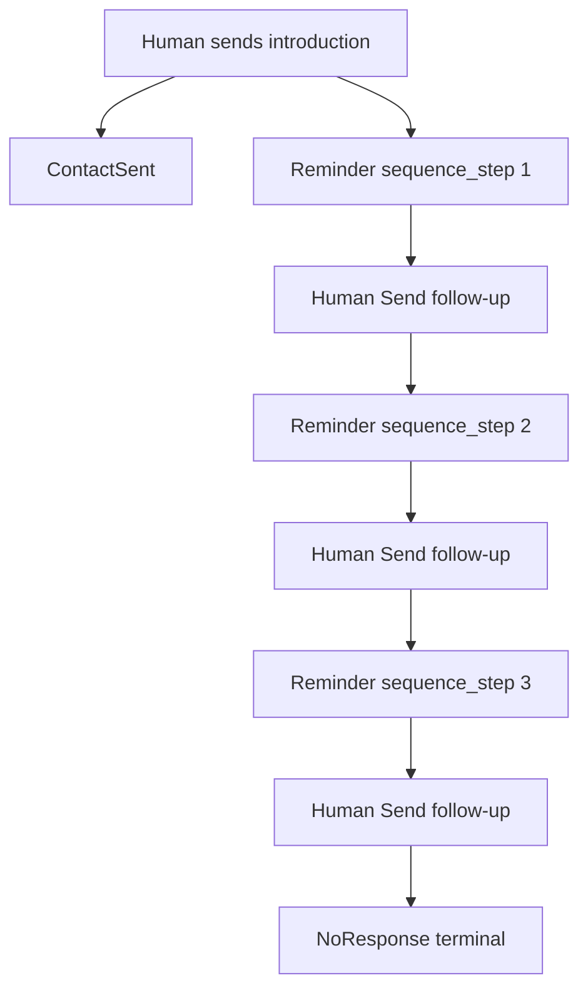

# ADR-021: Human-triggered follow-up email sequence

## Status

Accepted (2026-09-10)

## Partially supersedes

- The ordered eight-stage list in [ADR-005](ADR-005-fixed-sales-pipeline.md). The pipeline remains **fixed** (not admin-configurable). This ADR is authoritative for the **current ordered stages**, including stages already in code (`Contact Sent`, `Meeting Scheduled`, `Disqualified`) and the new terminal stage **No Response**.
- The “email sequences out of scope” bullet in [ADR-019](ADR-019-human-controlled-proposal-delivery.md). Inbox sync, conversation threads, and `In-Reply-To` remain out of scope. A **human-triggered** sequence of three follow-up emails is now in scope for [21 Follow-up email sequence](../05%20-%20Feature%20List.md#f21-follow-up-email-sequence).

ADR-019 still stands for: AI must never send client email autonomously; every outbound send is an explicit user action.

## Context

After the first-contact email is sent, the CRM already creates a follow-up **reminder** (+3 days at 09:00) and a short opportunity note. That reminder is not a send. There is no sequence step on the follow-up record, no Send action on the Follow-ups page, and no copywriter for follow-up emails.

The sales motion needs a three-step value-drip after the introduction: each email is a new insight on the **same** problem, written only when a user clicks **Send follow-up**. After the third send with no reply, the opportunity should leave the active pipeline as **No Response** (silence, not a lost deal and not a disqualification).

## Decision

### 1. Reminders are automatic; sends are not

1. Creating the next follow-up **reminder** after a successful send is a system action.
2. Sending the follow-up **email** is never automatic (no due-date cron, no Horizon auto-send).
3. The email goes out only when an authenticated user clicks **Send follow-up** on the Follow-ups page.

### 2. Sequence steps on follow-up records

Add nullable `sequence_step` on `follow_ups` (`1`, `2`, or `3`).

| `sequence_step` | Meaning |
| --------------- | ------- |
| `null` | Manual reminder. No Send follow-up button. |
| `1` | First follow-up email in the outreach sequence. |
| `2` | Second follow-up email. |
| `3` | Third (last) follow-up email. |

Manual CRUD follow-ups stay `null`. Sequence reminders are created only by the generalized contact listener (below), not by the Follow-ups create modal.

### 3. Generalized `ContactWithFollowUp`

Keep the existing event. Pass the step that was **just sent**:

| Just sent | Listener |
| --------- | -------- |
| Introduction (step `0`) | Move to `Contact Sent` if needed. Note: first email sent. Create reminder `sequence_step = 1`, due +3 days at 09:00, medium priority. |
| Follow-up 1 | Short note that follow-up 1 was sent. Create reminder `sequence_step = 2`, due +3 days at 09:00. Stay on `Contact Sent`. |
| Follow-up 2 | Short note that follow-up 2 was sent. Create reminder `sequence_step = 3`, due +3 days at 09:00. Stay on `Contact Sent`. |

Follow-up 3 **does not** dispatch `ContactWithFollowUp`. After a successful FU3 send: persist the email as a note, write that follow-up 3 was sent, and `moveToStage(NoResponse)`. Do not create a fourth reminder.

### 4. Send follow-up job

The Follow-ups index button is visible only when all of these are true:

- `reminder_status` is Pending
- `sequence_step` is 1, 2, or 3
- the linked opportunity exists and is in `Contact Sent`

Click:

1. Dispatch a queued job (Horizon / Redis).
2. Run a follow-up copywriter agent (same orchestration pattern as first-contact email).
3. Persist the generated subject and body as an opportunity note.
4. Send SMTP to the client contact email (same mail stack as first-contact outreach).
5. Mark the follow-up reminder completed.
6. If step 1 or 2: dispatch `ContactWithFollowUp`. If step 3: note + move to **No Response**.

There is **no** draft preview or regenerate on this path (unlike first-contact). The click is the human confirmation to write and send.

If the opportunity is no longer `Contact Sent` when the job runs, refuse: do not send, do not move stage, leave the reminder as the user left it. Do **not** bulk-delete sequence reminders when the stage changes.

### 5. Pipeline: No Response is a terminal stage

Canonical **ordered** stages:

1. Lead
2. Qualification
3. Contact
4. Contact Sent
5. Meeting Scheduled
6. Proposal Generation
7. Proposal Analysis
8. Proposal Sent
9. Won
10. Lost
11. **No Response**
12. Disqualified

**No Response** (`no_response`):

- Terminal (`isTerminal()` true), same as Won, Lost, and Disqualified.
- Kanban column after Lost and before Disqualified.
- Color token: `neutral` (silence, not a lost negotiation and not a bad-fit skip).
- `OpportunityStatus::Lost` when entering this stage (closed, not Open).
- Does not require user action (not a “needs click” column).

Won / Lost / Disqualified behavior is unchanged. Disqualified remains the skip/unfit terminal used by prospecting.

### 6. Copywriter contract

- Reuse first-contact tone: Gustavo Ferreira / Allison Hardy, Roger Pereira, Front Porch Creative.
- Same commercial problem as the introduction. Standalone emails (do not require reading the previous message).
- New unique subject each time (not `Re:`). One emoji in the subject; none in the body.
- Value drip: each follow-up uses a **new** insight and quick win. The agent receives previously sent copy (opportunity notes) so it does not repeat.
- CTA for FU1, FU2, and FU3: reply with 3 dates and times for a 1-hour online discovery meeting.
- FU3 also states clearly that this is the **last** email.

Prompt asset: `docs/prompts/laravel_tools/write-follow-up-email.md`.

### Out of scope

- Auto-send when the reminder is due.
- Inbox, threads, `In-Reply-To`, bounce handling.
- Preview / regenerate of follow-up copy before send.
- Automatic completion or deletion of pending reminders when the opportunity leaves Contact Sent.

## Consequences

- **Positive:**
  - Humans stay in control of every client email.
  - Sequence progress is explicit on the follow-up record.
  - Silence has a distinct terminal stage instead of overloading Lost or Disqualified.
- **Negative:**
  - Follow-up copy is not reviewed in-app before SMTP (the click is the approval).
  - ADR-005’s original eight-stage table is no longer the full list.
- **Neutral:**
  - First-contact still uses draft + Send on the opportunity AI panel.
  - Manual follow-ups remain available for calls and other work.

## References

- [21 Follow-up email sequence](../05%20-%20Feature%20List.md#f21-follow-up-email-sequence)
- [FDR-021](../FDRs/ToDo/FDR-021-follow-up-email-sequence.md)
- [ADR-005 Fixed sales pipeline](ADR-005-fixed-sales-pipeline.md)
- [ADR-019 Human-controlled proposal delivery](ADR-019-human-controlled-proposal-delivery.md)
- [ADR-017 First-contact email job](ADR-017-wave-4-ai-qualification-schema.md)
- [06 Follow-up management](../05%20-%20Feature%20List.md#f06-follow-up-management)
