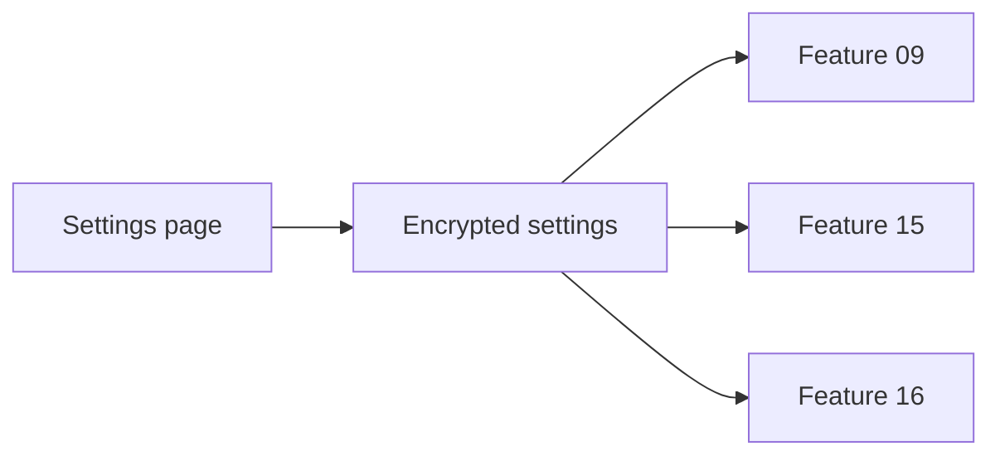

# FDR-017: Integration settings

**Feature:** 17  
**Status:** Closed (not implemented)  
**Closure reason:** Integration configuration (AI, Slack, Google Calendar) will be managed via `.env` and deployment secrets, not an in-app Settings UI.  
**Reference:** [17 Integration settings](../../05%20-%20Feature%20List.md#f17-integration-settings), [ADR-002](../../ADRs/ADR-002-ai-provider-abstraction.md), [ADR-009](../../ADRs/ADR-009-slack-integration.md), [ADR-010](../../ADRs/ADR-010-google-calendar-integration.md)

---

## How it works

1. **Settings** Livewire page (Design System includes Settings in nav).
2. Sections:
   - **AI:** active provider (OpenAI/Gemini), masked API key fields, model name optional
   - **Slack:** webhook URL or token, channel name/id
   - **Google Calendar:** calendar ID, credentials upload or service account JSON path
3. Persist in `settings` table or encrypted config repository; never expose secrets in UI after save.
4. Test connection buttons (optional): ping Slack, create/delete test calendar event, AI echo prompt.

---

## How to test

- Save settings; values encrypted at rest.
- Change AI provider; next agent job uses new provider (config cache cleared).
- Invalid credentials show user-safe error on “Test connection”.
- Only authenticated users access settings.

---

## Acceptance criteria

- [ ] Settings UI per Design System screen list.
- [ ] All MVP integrations configurable without `.env` edits for day-to-day ops (env fallback allowed for bootstrap).
- [ ] Secrets masked in forms.
- [ ] Documentation for initial setup in deployment notes.
- [ ] Feature tests for authorization and persistence.

---

## Deployment notes

- First-time setup may still require env for OAuth client IDs.
- Run `config:cache` carefully when settings drive runtime config.
