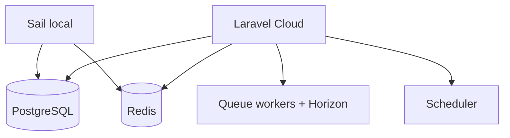

# FDR-001: Platform foundation

**Feature:** 01  
**Status:** Approved  
**Reference:** [01 Platform foundation](../../05%20-%20Feature%20List.md#f01-platform-foundation), [ADR-001](../../ADRs/ADR-001-technology-stack.md), [ADR-006](../../ADRs/ADR-006-queue-async-processing.md)

---

## How it works

1. Configure Sail services: **PostgreSQL**, **Redis**, application container.
2. Ensure Laravel 13 app runs migrations, cache, session, and queue connections against PostgreSQL/Redis.
3. Install and configure **Laravel Horizon** for queue monitoring.
4. Document Laravel Cloud deployment baseline (app, workers, scheduler, Redis, PostgreSQL).
5. Enable Laravel **scheduler** in production (cron → `schedule:run`).

---

## How to test

- `sail up` — all services healthy; `migrate` succeeds.
- Dispatch a test job — processed by worker; visible in Horizon.
- Scheduler list includes prospecting command placeholder (feature 10).

---

## Acceptance criteria

- [ ] PostgreSQL is the default DB; migrations run cleanly.
- [ ] Redis queue configured; test job completes.
- [ ] Horizon dashboard accessible to authenticated operators (route/policy TBD).
- [ ] Sail `docker-compose` documents PG + Redis + app.
- [ ] Deployment notes for Laravel Cloud (workers, scheduler, env) documented in README or ops doc.

---

## Deployment notes

- Production requires dedicated queue workers and Horizon; scheduler must run every minute.
- Set `APP_TIMEZONE` explicitly for weekday 08:00 prospecting ([ADR-007](../../ADRs/ADR-007-scheduled-prospecting.md)).
