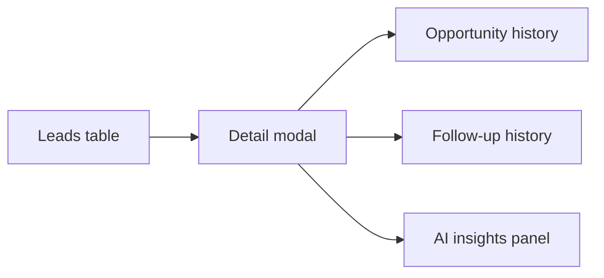

# FDR-004: Lead and client management

**Feature:** 04  
**Status:** Approved  
**Reference:** [04 Lead and client management](../../05%20-%20Feature%20List.md#f04-lead-client-management), [ADR-004](../../ADRs/ADR-004-unified-lead-client-entity.md)

---

## How it works

1. **Model/migration** for unified Lead/Client: company name, contacts, website, social links, lead source, qualification notes, AI insights (JSON/text), timestamps.
2. **CRUD** via Livewire: list (striped table per Design System §13), create/edit forms, **detail modal** for history fields.
3. User actions: contact intent, ignore, archive (status flags—no external messaging).
4. Relate **opportunity history** and **follow-up history** in detail view (read-only until features 05–06 exist).
5. Placeholder panel for AI insights (populated by features 11–12).

---

## How to test

- Create, edit, list, archive lead; table filters/search if specified.
- Detail modal shows all core attributes.
- Cannot delete lead referenced by open opportunity (rule TBD: soft delete vs block).
- Validation: required company name; URL format for website.

---

## Acceptance criteria

- [x] Single entity represents lead and client per ADR-004.
- [x] Table + modal UI per PRD and Design System.
- [x] Archive/ignore states persisted and filterable.
- [x] Factory/seed for development data.
- [x] Pest feature tests for CRUD and validation.

---

## Deployment notes

- None beyond standard migrations.
