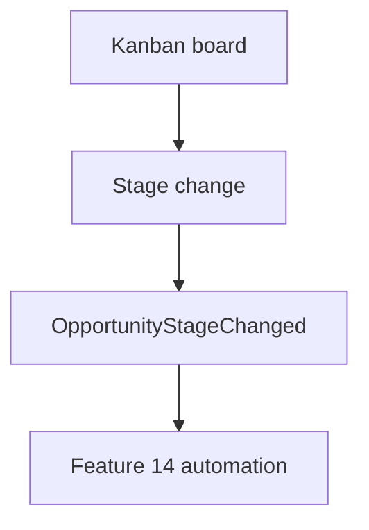

# FDR-005: Opportunity management and Kanban pipeline

**Feature:** 05  
**Status:** Approved  
**Reference:** [05 Opportunity management and Kanban pipeline](../../05%20-%20Feature%20List.md#f05-opportunity-kanban-pipeline), [ADR-005](../../ADRs/ADR-005-fixed-sales-pipeline.md)

---

## How it works

1. **Opportunity** model: title, stage (enum 8 values), estimated value, status, proposal fields, `client_id`, AI recommendations field.
2. **Kanban** Livewire UI: eight columns, cards show title, company, value, next follow-up, AI indicator (Design System §15).
3. **Move stage** via drag-drop or action menu; emit `OpportunityStageChanged` domain event for feature 14.
4. **Detail modal** for opportunity edit and linked client summary.
5. Stage colors from Design System §5 (Lead `neutral`, Qualification `ai`, etc.).

---

## How to test

- Create opportunity for existing client; appears in **Lead** column by default.
- Move through all stages; colors and labels correct.
- Won/Lost are terminal; optional guard on backward moves (product decision).
- Kanban responsive: horizontal scroll on mobile.

---

## Acceptance criteria

- [x] Fixed eight stages; not admin-configurable.
- [x] Kanban is primary opportunity UI.
- [x] Cards display required fields per Design System.
- [x] Stage change dispatches domain event.
- [x] Feature tests for stage transitions and validation.

---

## Deployment notes

- Index `client_id` and `stage` for dashboard queries.
