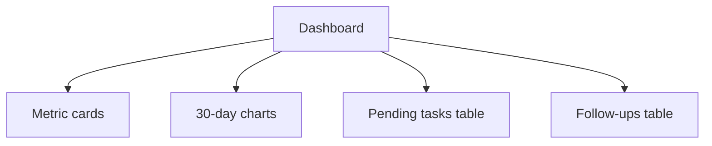

# FDR-008: Operational dashboard

**Feature:** 08  
**Status:** Approved  
**Reference:** [08 Operational dashboard](../../05%20-%20Feature%20List.md#f08-operational-dashboard), [ADR-014](../../ADRs/ADR-014-dashboard-observability-scope.md)

---

## How it works

1. Replace starter dashboard with CRM **operational dashboard** page.
2. **Metric cards:** leads created today; opportunities created today.
3. **Charts (30 days):** leads/day, opportunities/day, sales/day (sales = sum estimated value of Won opportunities per day—define in implementation).
4. **Tables:** pending tasks (feature 07), follow-ups (feature 06)—actionable, not overshadowed by charts per Design System §18.
5. Explicitly **exclude** AI metrics, queue health, failed jobs from this page.

---

## How to test

- Seed data across dates; verify card counts for “today”.
- Charts show 30-day series with correct aggregation.
- Tables list only pending/overdue items per rules.
- Authenticated-only access.

---

## Acceptance criteria

- [ ] All PRD dashboard sections present.
- [ ] No out-of-scope widgets per ADR-014.
- [ ] Charts subordinate to tables visually (Design System).
- [ ] Queries optimized (indexes on `created_at`, `stage`).
- [ ] Feature tests for metric calculations.

---

## Deployment notes

- Consider caching daily aggregates if volume grows (not required MVP).
