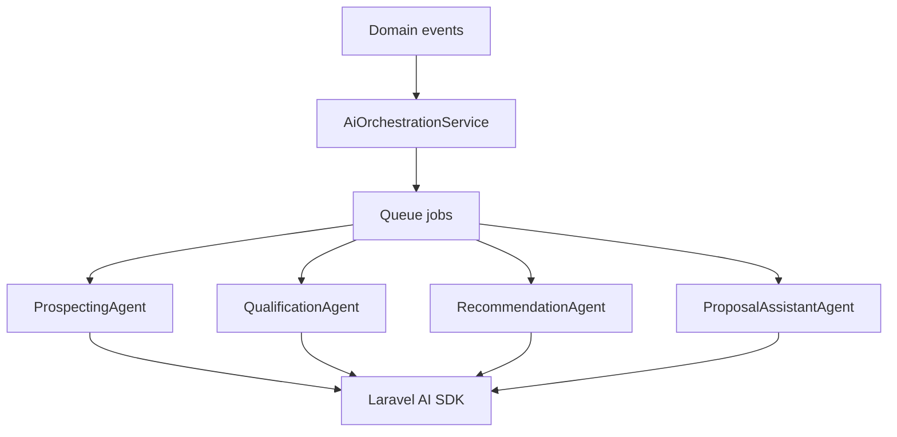

# FDR-009: AI provider layer and orchestration

**Feature:** 09  
**Status:** Approved  
**Reference:** [09 AI provider layer and orchestration](../../05%20-%20Feature%20List.md#f09-ai-orchestration), [ADR-002](../../ADRs/ADR-002-ai-provider-abstraction.md), [ADR-003](../../ADRs/ADR-003-ai-orchestration-architecture.md)

---

## How it works

1. Add **Laravel AI SDK** dependency; configure OpenAI and Gemini via env (`AI_PROVIDER`, API keys).
2. Implement **AiOrchestrationService** with methods to dispatch agent jobs by type.
3. Define agent interfaces: Prospecting, Qualification, Recommendation, ProposalAssistant.
4. Listeners on domain events (e.g. lead created, stage changed) enqueue appropriate jobs.
5. No provider failover in MVP ([ADR-002](../../ADRs/ADR-002-ai-provider-abstraction.md)).
6. Log request metadata (not full prompts in production if sensitive—ops decision).

---

## How to test

- Unit-test orchestration dispatches correct job class per event.
- Fake AI SDK responses in tests; verify structured DTO parsing.
- Switch provider via env in local; single provider active at a time.
- Failed AI call releases job with retry without breaking HTTP request.

---

## Acceptance criteria

- [x] Laravel AI SDK integrated with configurable provider.
- [x] Central orchestration service documented and injected.
- [x] Four agent entry points exist (may stub behavior until features 10–13).
- [x] Jobs use Redis queue with retries.
- [x] Tests use fakes/mocks; no live API in CI.

---

## Deployment notes

- Store API keys in Laravel Cloud secrets.
- Set job timeouts appropriate for LLM latency (e.g. 120–300s per job type).
