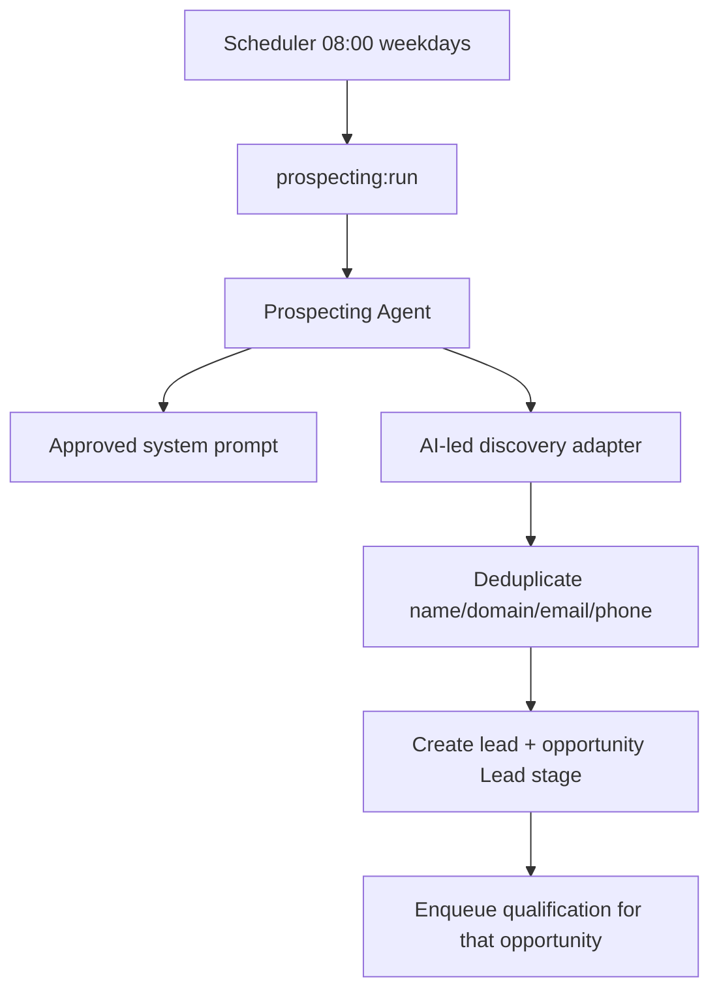

# FDR-010: Automated prospecting

**Feature:** 10  
**Status:** Approved  
**Reference:** [10 Automated prospecting](../../05%20-%20Feature%20List.md#f10-automated-prospecting), [ADR-007](../../ADRs/ADR-007-scheduled-prospecting.md), [ADR-015](../../ADRs/ADR-015-prospecting-discovery-undefined-mvp.md) (**Accepted**)

---

## Implementation readiness

| Dependency | ADR status | Impact on this FDR |
| ---------- | ----------- | ------------------ |
| [ADR-015 — Prospecting discovery](../../ADRs/ADR-015-prospecting-discovery-undefined-mvp.md) | **Accepted** | Discovery: AI-led active search on public/free sources; no paid data APIs; ethics/compliance per ADR. Approved prompt is versioned at `docs/prompts/prospecting-agent.md`. |
| [ADR-007 — Scheduled prospecting](../../ADRs/ADR-007-scheduled-prospecting.md) | Accepted | Schedule (`08:00` weekdays) can be implemented independently. |

### Stakeholder decisions (recorded 2026-05-29)

| # | Topic | Decision |
| - | ----- | -------- |
| 1 | Discovery mechanism | AI-led active prospecting; **compliant scraping** on public/free sources allowed; **all code in this repo** (no external scripts/services); approved system prompt required; subtle–moderate sales tone; LGPD/GDPR compliance |
| 2 | Deduplication | Company name + website domain (primary); email + phone when present (secondary) |
| 3 | MVP data sources | Public/free only: Google, Maps, websites, social networks, directories — **no paid data APIs** |

### Stakeholder deliverable

| Item | Status |
| ---- | ------ |
| Approved prospecting system prompt (versioned) | ☑ Supplied — `docs/prompts/prospecting-agent.md` |

---

## How it works

1. **Scheduled command** `prospecting:run` — weekdays 08:00 ([ADR-007](../../ADRs/ADR-007-scheduled-prospecting.md)).
2. Command calls orchestration to run **Prospecting Agent**.
3. Agent uses **pluggable discovery adapter** implementing [ADR-015](../../ADRs/ADR-015-prospecting-discovery-undefined-mvp.md): AI and/or **in-repo scraping** on public/free sources (no paid data APIs; no external unmanaged code).
4. Agent behavior driven by **approved prompt** (stakeholder-provided).
5. For each discovered company: create **Lead/Client** + **Opportunity** in stage **Lead**; mark source as prospecting.
6. **Deduplicate** before insert: match normalized company name or website domain; also email/phone when available.
7. The new **opportunity** enters the qualification queue (feature 11). Client-only rows are not qualified.

## How to test

- Schedule fake: run command manually; verify leads created.
- Mock discovery returns N records; dedup prevents duplicates (name, domain, email, phone cases).
- Qualification job dispatched for each new **opportunity**.
- No run on Saturday/Sunday.
- No live paid data API calls in CI; use mocks/fakes.

---

## Acceptance criteria

- [x] ADR-015 status is **Accepted**; discovery/dedup/source choices recorded in this FDR.
- [x] Approved prospecting prompt supplied and versioned in `docs/prompts/prospecting-agent.md`.
- [x] Approved prospecting prompt integrated and referenced in code/config.
- [x] Weekday 08:00 schedule registered.
- [x] Prospecting agent invoked via orchestration.
- [x] AI-led discovery adapter implemented per ADR-015 (public/free sources only).
- [x] Dedup: company name, website; email/phone when present.
- [x] New records in Lead stage with source marked as prospecting.
- [x] Qualification queue receives the new **opportunity**.
- [x] Tests use mocked discovery only (no live AI/data APIs in CI).

---

## Deployment notes

- Confirm `APP_TIMEZONE` for 08:00.
- Scheduler must run in production.
- `AI_PROVIDER` + API keys for inference (not paid **data** APIs per ADR-015).
