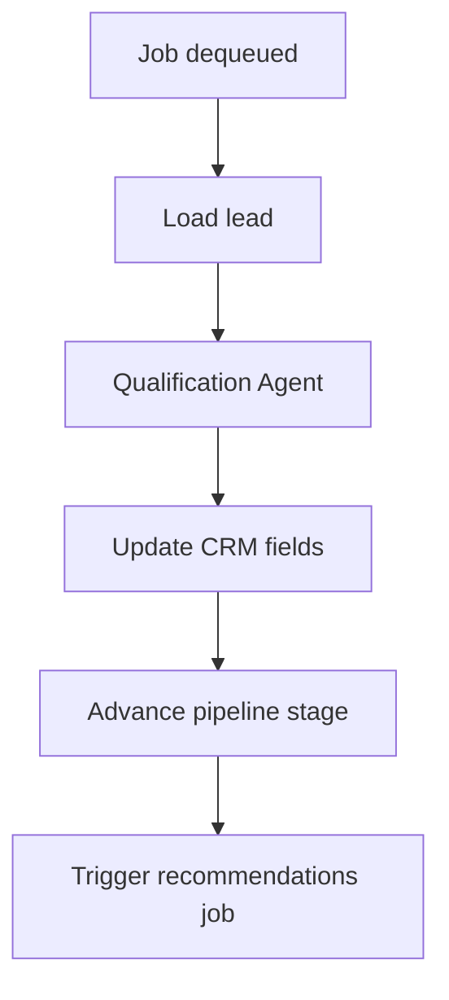

# FDR-011: Automated lead qualification

**Feature:** 11  
**Status:** Approved  
**Reference:** [11 Automated lead qualification](../../05%20-%20Feature%20List.md#f11-automated-lead-qualification), [ADR-003](../../ADRs/ADR-003-ai-orchestration-architecture.md), [ADR-006](../../ADRs/ADR-006-queue-async-processing.md), [ADR-015](../../ADRs/ADR-015-prospecting-discovery-undefined-mvp.md) (**Accepted**, via [FDR-010](../Done/FDR-010-automated-prospecting.md)), [ADR-017](../../ADRs/ADR-017-wave-4-ai-qualification-schema.md)

---

## Implementation readiness

| Dependency | ADR status | Impact on this FDR |
| ---------- | ----------- | ------------------ |
| [ADR-015 — Prospecting discovery](../../ADRs/ADR-015-prospecting-discovery-undefined-mvp.md) | **Accepted** | Qualification handoff from **automated prospecting** ships with FDR-010. Manual lead qualification is also in scope because all created leads qualify automatically per ADR-017. |
| [ADR-005 — Fixed pipeline](../../ADRs/ADR-005-fixed-sales-pipeline.md) | Accepted | Stage names fixed; successful qualification advances linked opportunities to **Contact** per ADR-017. |
| [ADR-017 — Wave 4 AI qualification flow and insight schema](../../ADRs/ADR-017-wave-4-ai-qualification-schema.md) | Accepted | All created leads are qualified automatically; status/error fields and AI insight schema are defined. |

### Stakeholder decisions (recorded 2026-07-31)

| # | Topic | Status |
| - | ----- | ------ |
| 1 | Enqueue qualification on manual lead create? | ☑ Yes — all created leads are qualified automatically |
| 2 | Post-qualification pipeline target | ☑ **Contact** |
| 3 | Automated prospecting → qualification handoff | ☑ Ships with FDR-010 (ADR-015 **Accepted**) |
| 4 | Qualification status and UI | ☑ Dedicated qualification status column, rendered as labels/chips |
| 5 | AI insight schema | ☑ Schema version 1 per ADR-017 |

Core qualification job, AI enrichment, and retries can proceed with **mocked** leads. Prompt is versioned at `docs/prompts/qualification-agent.md`.

---

## How it works

1. **Qualification queue:** jobs triggered for every created lead (from prospecting or manual create).
2. **Qualification Agent** analyzes: website issues, digital presence, pain points, opportunities.
3. Update lead: qualification notes, AI insights JSON, enrichment fields.
4. Move linked opportunity: **Lead** → **Qualification** during processing; after success → **Contact**.
5. On failure: retry with backoff; store a user-safe qualification error on the lead; do not block CRM UI.

---

## How to test

- Paid/ready lead fixture processed; fields populated.
- AI failure retries; after max attempts, error visible on record.
- Stage transitions match ADR-005 rules.
- Manual lead creation enqueues qualification.

---

## Acceptance criteria

- [x] Async qualification via Redis queue.
- [x] CRM record updated with analysis output.
- [x] Pipeline stage advances to **Contact** after successful qualification.
- [x] Failures isolated per ADR-012.
- [x] Dispatches recommendation job (feature 12) on success.
- [x] Tests with mocked AI responses.
- [x] Qualification status chips render `pending`, `processing`, `qualified`, and `failed`.

---

## Deployment notes

- Worker concurrency limits to control AI spend.
