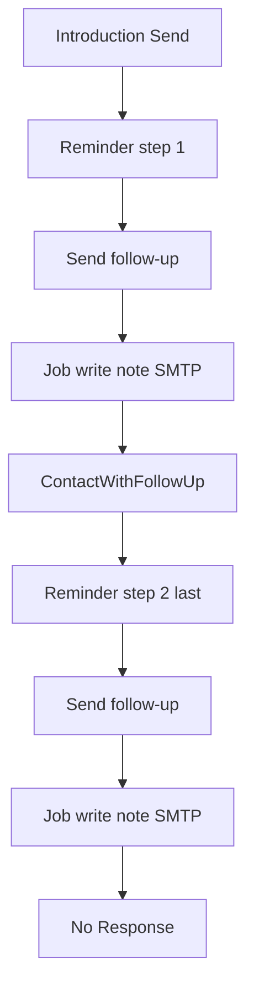

# FDR-021: Follow-up email sequence

**Feature:** 21  
**Status:** Implemented  
**Reference:** [21 Follow-up email sequence](../../05%20-%20Feature%20List.md#f21-follow-up-email-sequence), [06 Follow-up management](../../05%20-%20Feature%20List.md#f06-follow-up-management), [05 Opportunity management and Kanban pipeline](../../05%20-%20Feature%20List.md#f05-opportunity-kanban-pipeline), [19 Opportunity notes](../../05%20-%20Feature%20List.md#f19-opportunity-notes), [ADR-021](../../ADRs/ADR-021-follow-up-email-sequence.md), [ADR-005](../../ADRs/ADR-005-fixed-sales-pipeline.md), [ADR-019](../../ADRs/ADR-019-human-controlled-proposal-delivery.md)

---

## How it works

### Already in the product (extend, do not duplicate)

Sending the introduction from the opportunity AI panel already:

1. Sends SMTP (`FirstContactOutreachMail`).
2. Dispatches `ContactWithFollowUp`.
3. Moves the opportunity to **Contact Sent**.
4. Creates a follow-up reminder (+3 days at 09:00, medium priority).
5. Writes an opportunity note that the first email was sent.

This FDR adds **sequence steps**, a **Send follow-up** action, a **copywriter job**, and the terminal stage **No Response**.

### Sequence storytelling

Same voice as the first-contact prompt (Gustavo Ferreira / Allison Hardy; Roger Pereira; Front Porch Creative). Stay on the **same problem** as the introduction. Each follow-up **stands alone** (does not depend on the reader having opened the previous email). New subject each time (not `Re:`).

| Email | Job | CTA |
| ----- | --- | --- |
| Introduction (existing) | Observation + quick win | Reply with 3 dates and times for a 1-hour online discovery meeting |
| Follow-up 1 | **New** insight + quick win, same problem | Same CTA |
| Follow-up 2 | **New** insight + quick win, and state clearly this is the **last** email | Same CTA, last-email tone |

The copywriter receives the introduction `contact_example` as `previous_emails`, plus existing opportunity notes, so it does not repeat an insight or quick win.

Prompt: `docs/prompts/laravel_tools/write-follow-up-email.md`.

### Reminders vs send

- **Reminder:** system-created after introduction and follow-up 1.
- **Send:** never automatic. Only when a user clicks **Send follow-up** on the Follow-ups page.

### Data

1. Add nullable `sequence_step` on `follow_ups` (`1` | `2`). `null` = manual follow-up (no send button).
2. Add pipeline stage `No Response` (`no_response`): terminal, Kanban order after Lost and before Disqualified, color token `neutral`, sets `OpportunityStatus::Lost`.

### Introduction send (listener change)

`HandleContactWithFollowUp` after the introduction (just-sent step `0`):

- Keep move to Contact Sent and the “first email sent” note.
- Create the reminder with `sequence_step = 1` (not a generic untyped reminder).

### Follow-ups page

On `[follow-ups.index](../../../app/Livewire/FollowUps/Index.php)`, each row may show **Send follow-up** when:

- the follow-up is Pending
- `sequence_step` is 1 or 2
- the opportunity is in Contact Sent

Use `data-test="follow-ups-send-email"` (include the follow-up id in the selector, e.g. `follow-ups-send-email-{id}`).

Manual follow-ups (`sequence_step` null) do not get the button. If the opportunity has left Contact Sent, hide the button; do not delete the reminder.

### Send click (no preview)

1. Dispatch a queued job.
2. Follow-up copywriter agent writes subject + body for that `sequence_step`.
3. Save the sent email (subject and body) as an opportunity note.
4. Send SMTP to the client contact email (same stack as first-contact outreach).
5. Mark the follow-up reminder completed.
6. **Step 1:** dispatch `ContactWithFollowUp` with the step just sent → short note “Follow-up 1 sent” → create the next reminder (`sequence_step = 2`, +3 days at 09:00).
7. **Step 2:** short note that follow-up 2 was sent → `moveToStage(NoResponse)`. Do not dispatch `ContactWithFollowUp`. Do not create another reminder.

If the job runs and the opportunity is not in Contact Sent: do not send, do not change stage, leave the reminder unchanged.

Failed SMTP: do not complete the reminder, do not create the next reminder, do not move to No Response.

---

## How to test

- **Introduction:** Send first-contact email; opportunity is Contact Sent; note exists; pending follow-up has `sequence_step = 1` and due date +3 days at 09:00.
- **Send FU1:** Button visible on that row; click queues job; note contains subject/body; SMTP sent; reminder completed; new pending follow-up with `sequence_step = 2`.
- **Send FU2:** SMTP + notes; opportunity moves to No Response; status Lost; no third sequence reminder; `ContactWithFollowUp` not dispatched.
- **Manual follow-up:** No Send follow-up button.
- **Wrong stage:** Opportunity in Meeting Scheduled (or any stage other than Contact Sent): button hidden; if a job is forced, it does not send.
- **SMTP failure:** Reminder stays pending; stage unchanged.
- **Copywriter:** FU2 output states it is the last email; FU1 does not claim that; subjects are not `Re:`; previously used insights are not reused (feature test with fake agent).
- **Kanban:** No Response column exists, is terminal, sits between Lost and Disqualified.
- **Browser:** Follow-ups index send button (`data-test`); opportunity can be moved to No Response; notes timeline shows the saved email.
- **Translations:** Button and stage labels covered for each app locale in Feature tests.

---

## Acceptance criteria

- [x] `follow_ups.sequence_step` nullable 1–2; manual follow-ups remain null.
- [x] Introduction send creates `sequence_step = 1` reminder (+3 days 09:00).
- [x] Follow-ups index **Send follow-up** only for pending sequence rows whose opportunity is Contact Sent (`data-test` stable).
- [x] Click dispatches a job: copywriter → opportunity note with subject/body → SMTP → complete reminder.
- [x] FU1 dispatches generalized `ContactWithFollowUp` and creates the `sequence_step = 2` reminder.
- [x] FU2 does not dispatch that event; notes the send; moves the opportunity to **No Response**.
- [x] No Response is terminal, ordered after Lost and before Disqualified, `OpportunityStatus::Lost`, color token `neutral`.
- [x] No due-date auto-send. No bulk-delete of reminders on stage change.
- [x] Follow-up prompt documents the storytelling table (new insight per step; FU2 last-email; same CTA).
- [x] Feature + Pest Browser coverage for the flows above.

---

## Deployment notes

- Horizon / Redis workers must run; size job timeout for LLM latency like other AI jobs.
- SMTP as today (Mailpit locally).
- Existing pending follow-ups created before this feature have `sequence_step` null (no send button) until a new introduction send creates a sequenced reminder.
