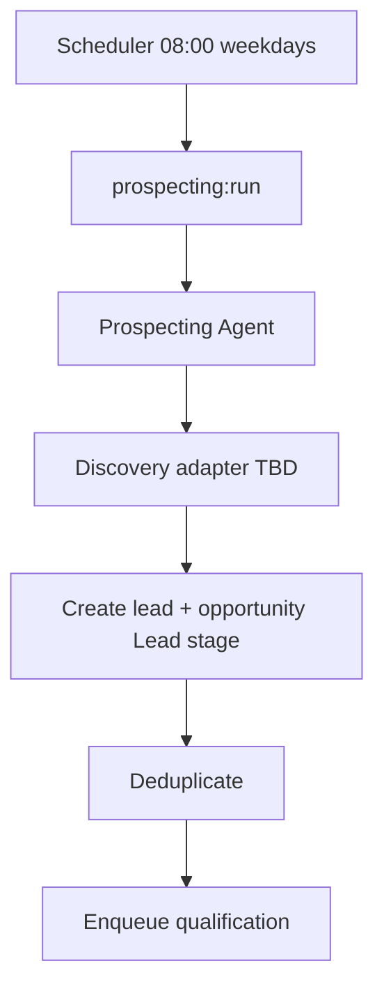

# FDR-010: Automated prospecting

**Feature:** 10  
**Status:** Approved  
**Reference:** [10 Automated prospecting](../../05%20-%20Feature%20List.md#f10-automated-prospecting), [ADR-007](../../ADRs/ADR-007-scheduled-prospecting.md), [ADR-015](../../ADRs/ADR-015-prospecting-discovery-undefined-mvp.md) (**Proposed**)

---

## Implementation readiness

| Dependency | ADR status | Impact on this FDR |
| ---------- | ----------- | ------------------ |
| [ADR-015 — Prospecting discovery](../../ADRs/ADR-015-prospecting-discovery-undefined-mvp.md) | **Proposed** | **Blocked:** concrete discovery adapter, allowed sources, and dedup rules must not be implemented until ADR-015 is **Accepted** and confirmed in the table below. |
| [ADR-007 — Scheduled prospecting](../../ADRs/ADR-007-scheduled-prospecting.md) | Accepted | Schedule (`08:00` weekdays) can be implemented independently. |

### Decisions required before build (confirm with stakeholder)

| # | Topic | Status |
| - | ----- | ------ |
| 1 | Discovery mechanism (APIs, list, assisted flow, etc.) | ☐ Not confirmed — see ADR-015 |
| 2 | Deduplication rules (domain / company name / both) | ☐ Not confirmed — see ADR-015 |
| 3 | MVP data sources (Maps, social, directories, etc.) | ☐ Not confirmed — see ADR-015 |

Until the above are confirmed and ADR-015 is **Accepted**, implement only: scheduler shell, orchestration hook, and a **stub/no-op discovery adapter** for tests.

---

## How it works

1. **Scheduled command** `prospecting:run` — weekdays 08:00 ([ADR-007](../../ADRs/ADR-007-scheduled-prospecting.md)).
2. Command calls orchestration to run **Prospecting Agent**.
3. Agent uses **pluggable discovery adapter** (implementation TBD per ADR-015—must be agreed before coding adapter).
4. For each discovered company: create **Lead/Client** + **Opportunity** in stage **Lead**.
5. Deduplicate by website/domain or company name (rules TBD in implementation)
6. If not duplicated, enqueue **qualification** job (feature 11).

## How to test

- Schedule fake: run command manually; verify leads created.
- Mock discovery returns N records; dedup prevents duplicates.
- Qualification job dispatched for each new lead.
- No run on Saturday/Sunday.

---

## Acceptance criteria

- [ ] ADR-015 status is **Accepted**; discovery/dedup rows in ADR-015 checked; choices recorded in this FDR.
- [ ] Weekday 08:00 schedule registered.
- [ ] Prospecting agent invoked via orchestration.
- [ ] New records in Lead stage with source marked as prospecting.
- [ ] Qualification queue receives new leads.
- [ ] Discovery adapter interface documented; concrete adapter implemented **only after** ADR-015 **Accepted**.
- [ ] Tests use mocked discovery only.

---

## Deployment notes

- Confirm `APP_TIMEZONE` for 08:00.
- Scheduler must run in production.
