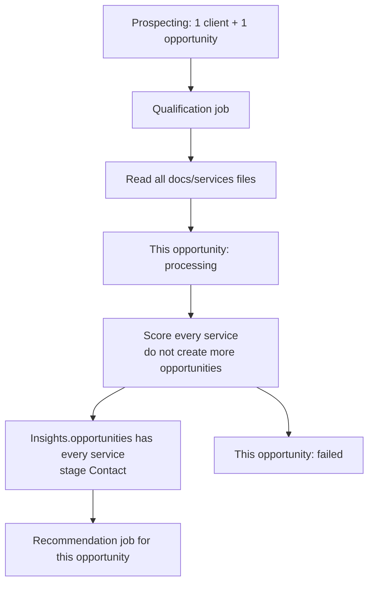

# FDR-011: Automated lead qualification

**Feature:** 11  
**Status:** Approved (rework — opportunity-scoped)  
**Reference:** [11 Automated lead qualification](../../05%20-%20Feature%20List.md#f11-automated-lead-qualification), [ADR-003](../../ADRs/ADR-003-ai-orchestration-architecture.md), [ADR-006](../../ADRs/ADR-006-queue-async-processing.md), [ADR-015](../../ADRs/ADR-015-prospecting-discovery-undefined-mvp.md) (**Accepted**, via [FDR-010](../Done/FDR-010-automated-prospecting.md)), [ADR-017](../../ADRs/ADR-017-wave-4-ai-qualification-schema.md) (**Accepted**, amended 2026-08-13)

---

## Implementation readiness

| Dependency | ADR status | Impact on this FDR |
| ---------- | ----------- | ------------------ |
| [ADR-015 — Prospecting discovery](../../ADRs/ADR-015-prospecting-discovery-undefined-mvp.md) | **Accepted** | Prospecting creates a Client plus an Opportunity in **Lead**. Qualification is enqueued for **that opportunity**, not for the client. |
| [ADR-005 — Fixed pipeline](../../ADRs/ADR-005-fixed-sales-pipeline.md) | Accepted | Stage names fixed; successful qualification advances **that** opportunity to **Contact**. |
| [ADR-017 — Wave 4 AI qualification flow and insight schema](../../ADRs/ADR-017-wave-4-ai-qualification-schema.md) | Accepted (amended 2026-08-13) | Qualification belongs to the **opportunity**. Status, error, timestamp, notes, and schema v1 insights persist on the opportunity. A client may have many opportunities over time; each is qualified independently. |

### Stakeholder decisions

| # | Topic | Status |
| - | ----- | ------ |
| 1 | What is qualified? | ☑ **Opportunity**, not Client (recorded 2026-08-13). The same company can have new deals later (website now, content later, email + automation later, a new website years later). |
| 2 | When does qualification start? | ☑ Automatically when an **opportunity is created** (prospecting or manual). Creating a client without an opportunity does not start qualification. No “Qualify” button for the normal path. |
| 3 | Post-qualification pipeline target | ☑ **Contact** — only the opportunity being qualified. Sibling opportunities stay where they are. |
| 4 | Automated prospecting → qualification handoff | ☑ Ships with FDR-010: prospecting creates the opportunity; opportunity create enqueues qualification. |
| 5 | Qualification status and UI | ☑ Dedicated columns on **opportunities**, rendered as chips on the Kanban and opportunity detail. |
| 6 | AI insight schema | ☑ Schema version 1 per ADR-017, stored on the **opportunity**. |
| 7 | Repeat qualification on the same client | ☑ A client that already has a qualified opportunity must **not** skip analysis of a new opportunity. |
| 8 | Initial qualification catalog (prospecting) | ☑ When the lead comes from `app/Ai/Agents/ProspectingAgent.php`, qualify **all** services in `docs/services/`. Do **not** create one opportunity per service for a new client. One opportunity (the one prospecting already creates) holds the full catalog analysis. Later opportunities on that client are qualified as that deal only. |

Core qualification job, AI enrichment, and retries can proceed with **mocked** AI. Prompt is versioned at `docs/prompts/qualification-agent.md`. Service catalog is the markdown files in `docs/services/` (read each file in full; do not parse headings). The prompt must cover: (a) **initial** prospecting qualification against **every** service file, stored on the single new opportunity; (b) **later** opportunities, analyzed as that deal only.

---

## How it works

**Client** is the company (identity, contacts, website, source). It is not marked qualified / failed.

**Opportunity** is the commercial deal. Qualification always persists on the opportunity being processed.

**Initial qualification (lead from ProspectingAgent):** prospecting already creates one Client and one Opportunity. That job reads every file in `docs/services/` and scores **all** Front Porch services against the company. It does **not** open a Kanban card per service. The single opportunity stores the full catalog in schema v1 `ai_insights.opportunities` (one entry per service file, including low-fit).

**Later opportunities** (same client, months or years later): qualify **that** deal only. A prior catalog scan does not skip or replace this run.

1. **Queue:** dispatch a qualification job when an opportunity is created (prospecting or user), or when that opportunity is moved to **Qualification** and it is not already `processing` or `qualified`.
2. **Qualification Agent** loads the opportunity, its client, and the service files. For a prospecting-created first opportunity, pass **all** `docs/services/*.md` contents. For a later opportunity, pass company context plus that opportunity’s title/angle (still using `docs/services` as the catalog). It does not treat a prior qualified opportunity on the same client as “already done”.
3. While the job runs: set **this** opportunity to `processing`; if it is in **Lead**, move it to **Qualification**.
4. On success: persist qualification notes, schema v1 `ai_insights` (including `contact_example`), `qualified_at`, and status `qualified` on **this** opportunity; move it to **Contact**; dispatch the recommendation job for **this** opportunity.
5. On failure: retry with backoff; store a user-safe error on **this** opportunity (`failed`); do not block CRM UI; do not change sibling opportunities.
6. Never create extra opportunities just to represent catalog services on a new client.

`qualified` on the chip means the analysis job finished. Commercial fit remains inside `ai_insights.fit` (`high` / `medium` / `low`). Failed means the job could not complete, not “rejected lead”.

---

## How to test

- Prospecting creates a client + **one** opportunity; qualification reads all `docs/services/` files; `ai_insights.opportunities` has one entry per service; **no** extra opportunities are created.
- Manual opportunity create on an existing client enqueues qualification for **that** deal only, even if that client already has a `qualified` opportunity.
- Creating a client with no opportunity does **not** enqueue qualification.
- Only the opportunity under analysis moves Lead → Qualification → Contact; siblings stay put.
- AI failure retries; after max attempts, error is visible on **that** opportunity; CRM CRUD still works.
- No automatic email is sent.
- Tests use mocked AI.

---

## Acceptance criteria

- [ ] Qualification fields live on **opportunities** (`qualification_status`, `qualification_last_error`, `qualified_at`, AI `qualification_notes`, schema v1 insights). Client is not the qualification record.
- [ ] Async qualification via Redis queue, keyed by `opportunity_id`.
- [ ] New opportunities are qualified automatically (prospecting and manual create). Client-only create does not start qualification.
- [ ] A new opportunity on a client that already has a qualified deal is analyzed again.
- [ ] Only the opportunity being qualified advances to **Contact** after success.
- [ ] Failures isolated per ADR-012 on that opportunity.
- [ ] Dispatches recommendation job (feature 12) for that opportunity on success.
- [ ] Qualification status chips render `pending`, `processing`, `qualified`, and `failed` on the Kanban and opportunity detail.
- [ ] Approved prompt is opportunity-scoped (`docs/prompts/qualification-agent.md`). Initial prospecting runs include every file in `docs/services/`; later runs qualify that deal only.
- [ ] Prospecting initial qualification does **not** create one opportunity per service.
- [ ] Tests with mocked AI responses, including: (a) repeat-deal case; (b) prospecting initial run returns an `opportunities` entry for every `docs/services` file and a single opportunity row.

---

## Deployment notes

- Worker concurrency limits to control AI spend. Each new opportunity can trigger a new AI run; the same client over years must not share one qualification result.
