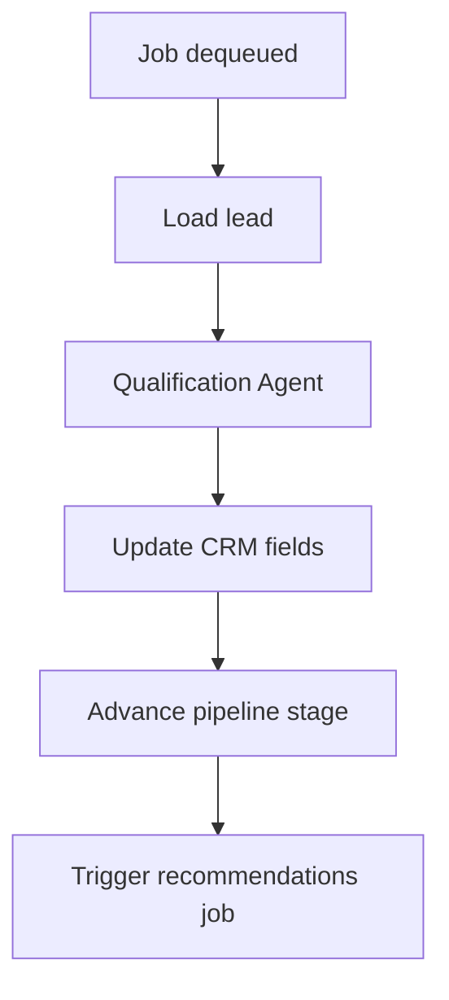

# FDR-011: Automated lead qualification

**Feature:** 11  
**Status:** Approved  
**Reference:** [11 Automated lead qualification](../../05%20-%20Feature%20List.md#f11-automated-lead-qualification), [ADR-003](../../ADRs/ADR-003-ai-orchestration-architecture.md), [ADR-006](../../ADRs/ADR-006-queue-async-processing.md), [ADR-015](../../ADRs/ADR-015-prospecting-discovery-undefined-mvp.md) (**Proposed**, via [FDR-010](FDR-010-automated-prospecting.md))

---

## Implementation readiness

| Dependency | ADR status | Impact on this FDR |
| ---------- | ----------- | ------------------ |
| [ADR-015 — Prospecting discovery](../../ADRs/ADR-015-prospecting-discovery-undefined-mvp.md) | **Proposed** | **Partial:** qualification queue from **automated prospecting** depends on FDR-010/ADR-015. Manual lead → qualification can be built earlier if enqueue policy is confirmed below. |
| [ADR-005 — Fixed pipeline](../../ADRs/ADR-005-fixed-sales-pipeline.md) | Accepted | Stage names fixed; **target stage after qualification** still needs product confirmation (see below). |

### Decisions required before build (confirm with stakeholder)

| # | Topic | Status |
| - | ----- | ------ |
| 1 | Enqueue qualification on manual lead create? | ☐ Not confirmed |
| 2 | Post-qualification pipeline target: **Contact** vs stay in **Qualification** | ☐ Not confirmed (HLD: “moved to the next stage after analysis”) |
| 3 | Automated prospecting → qualification handoff | ☐ Blocked until ADR-015 **Accepted** |

Core qualification job, AI enrichment, and retries can proceed with **mocked** leads; finalize stage-transition rules before production.

---

## How it works

1. **Qualification queue:** jobs triggered when leads enter queue (from prospecting or manual create—policy TBD).
2. **Qualification Agent** analyzes: website issues, digital presence, pain points, opportunities.
3. Update lead: qualification notes, AI insights JSON, enrichment fields.
4. Move linked opportunity: **Lead** → **Qualification** during processing; after success → **next stage per confirmed rule** (default assumption in draft: **Contact** — **not confirmed**, see table above).
5. On failure: retry with backoff; store `last_error` on lead; do not block CRM UI.

---

## How to test

- Paid/ready lead fixture processed; fields populated.
- AI failure retries; after max attempts, error visible on record.
- Stage transitions match ADR-005 rules.
- Manual lead creation can enqueue qualification (if in scope).

---

## Acceptance criteria

- [ ] Async qualification via Redis queue.
- [ ] CRM record updated with analysis output.
- [ ] Pipeline stage advances per HLD after successful qualification.
- [ ] Failures isolated per ADR-012.
- [ ] Dispatches recommendation job (feature 12) on success.
- [ ] Tests with mocked AI responses.

---

## Deployment notes

- Worker concurrency limits to control AI spend.
