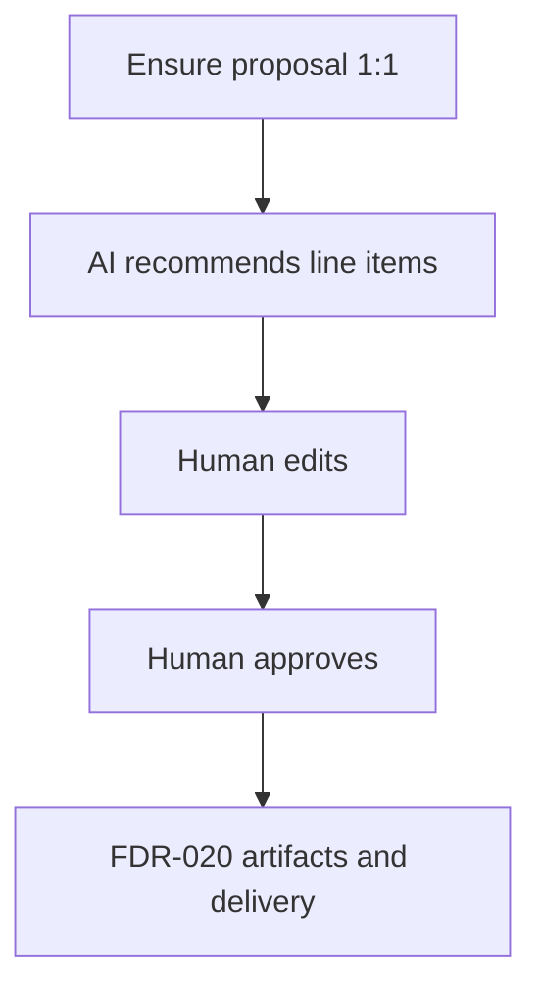

# FDR-013: Proposal assistance

**Feature:** 13  
**Status:** Approved  
**Reference:** [13 Proposal assistance](../../05%20-%20Feature%20List.md#f13-proposal-assistance), [ADR-018](../../ADRs/ADR-018-proposal-artifact-rendering-and-delivery.md), [ADR-019](../../ADRs/ADR-019-human-controlled-proposal-delivery.md), [ADR-003](../../ADRs/ADR-003-ai-orchestration-architecture.md), [18 Commercial service catalog](../../05%20-%20Feature%20List.md#f18-commercial-service-catalog), [19 Opportunity notes](../../05%20-%20Feature%20List.md#f19-opportunity-notes)

---

## Implementation readiness

| Dependency | Status | Impact |
| ---------- | ------ | ------ |
| [ADR-018](../../ADRs/ADR-018-proposal-artifact-rendering-and-delivery.md) | Accepted | Supersedes ADR-016; domain and lifecycle decided |
| [FDR-018](../Done/FDR-018-commercial-service-catalog.md) | Done (Wave 5) | Catalog line items available |
| [FDR-019](FDR-019-opportunity-notes.md) | ToDo (Wave 5) | Notes timeline required as AI context |
| [FDR-020](FDR-020-proposal-artifacts-and-delivery.md) | ToDo (Wave 7) | Artifacts/PDF/email are a separate feature; this FDR stops at approved proposal content/line items |

---

## How it works

1. When an opportunity needs a proposal (enter **Proposal Generation** or explicit regenerate), ensure a single `proposals` row exists for that opportunity (`opportunity_id` unique).
2. **Proposal Assistant** recommends commercial catalog services and values into proposal line items, using:
   - Client and opportunity data
   - Qualification / recommendation insights
   - Opportunity notes timeline
3. Human edits line items (add/remove catalog services, adjust unit prices/qty) and related draft fields owned by this feature.
4. Human **approves** the proposal (store approver + timestamp on the proposal). Approval does not send email and does not by itself move the stage to Proposal Sent.
5. Regenerating recommendations **overwrites** current draft line-item suggestions / regenerable fields on the same proposal record (no version history).
6. Artifact generation, PDF, and send live in [FDR-020](FDR-020-proposal-artifacts-and-delivery.md); stage automation wiring lives in [FDR-014](FDR-014-pipeline-stage-automation.md).

---

## How to test

- Creating/opening proposal for an opportunity always yields one row; second create is idempotent.
- AI recommendation (mocked) populates line items from catalog without changing catalog defaults.
- Human can override prices; catalog default price remains unchanged.
- Approval persists user and timestamp; unapproved proposal cannot proceed to artifact generation hooks used by FDR-020.
- AI failure leaves opportunity and prior proposal data uncorrupted.
- Feature tests with mocked agent output; browser coverage for proposal editor entry points.

---

## Acceptance criteria

- [ ] `proposals` table with unique `opportunity_id` and line items referencing catalog services.
- [ ] Proposal Assistant recommends services/values via orchestration; human can edit before approve.
- [ ] Explicit human approval recorded on the proposal.
- [ ] No autonomous client delivery from this feature.
- [ ] Tests with mocked agent output; regenerate overwrites the same proposal.
- [ ] Depends on catalog + notes features being available.

---

## Deployment notes

- Queue workers/Horizon required for recommendation jobs; timeout must exceed LLM latency.
