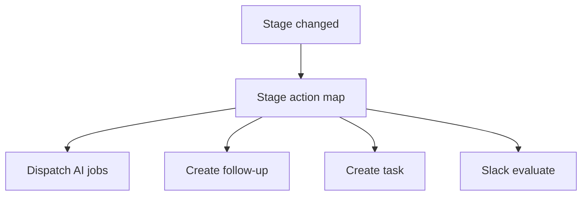

# FDR-014: Pipeline stage-based automation

**Feature:** 14  
**Status:** Approved  
**Reference:** [14 Pipeline stage-based automation](../../05%20-%20Feature%20List.md#f14-pipeline-stage-automation), [ADR-003](../../ADRs/ADR-003-ai-orchestration-architecture.md), [ADR-005](../../ADRs/ADR-005-fixed-sales-pipeline.md), [ADR-016](../../ADRs/ADR-016-proposal-generation-undefined-mvp.md) (**Proposed**)

---

## Implementation readiness

| Dependency | ADR status | Impact on this FDR |
| ---------- | ----------- | ------------------ |
| [ADR-016 — Proposal format](../../ADRs/ADR-016-proposal-generation-undefined-mvp.md) | **Proposed** | **Partial:** stage map entry for **→ Proposal Generation** (dispatch proposal assistant) must use a **stub** until ADR-016 is **Accepted** and [FDR-013](FDR-013-proposal-assistance.md) is updated. |
| [FDR-011 — Qualification](../../FDRs/ToDo/FDR-011-automated-lead-qualification.md) | Pending decisions | **→ Qualification** automation should align with confirmed post-qualification stage rules. |

Other stage actions (follow-ups, tasks, Slack hooks) can be implemented without ADR-016.

---

## How it works

1. Listen for **`OpportunityStageChanged`** with `from`, `to`, `opportunity_id`.
2. Configurable **stage → actions** map (PHP config class), e.g.:
   - → Qualification: enqueue qualification (if not done)
   - → Proposal Generation: enqueue proposal assistant (**full behavior blocked** until ADR-016 **Accepted**; stub OK for wiring tests)
   - → Contact: optional default follow-up task template
3. May create **follow-ups** or **tasks** automatically (templates per stage).
4. May notify Slack when action required (delegate to feature 15).
5. **No job chaining** assumption—each action dispatches independent jobs.

---

## How to test

- Move opportunity to each stage; verify expected side effects (mock externals).
- Idempotent: repeating same stage does not duplicate tasks (guards).
- Invalid transition handled gracefully.

---

## Acceptance criteria

- [ ] Central listener registered for stage changes.
- [ ] Stage map covers HLD-critical automations (qualification, proposal stub until ADR-016 **Accepted**).
- [ ] Auto-created follow-ups/tasks link correct entities.
- [ ] Does not violate human-approval ADR for outbound actions.
- [ ] Feature tests per stage rule.

---

## Deployment notes

- Document stage map in config for ops review.
