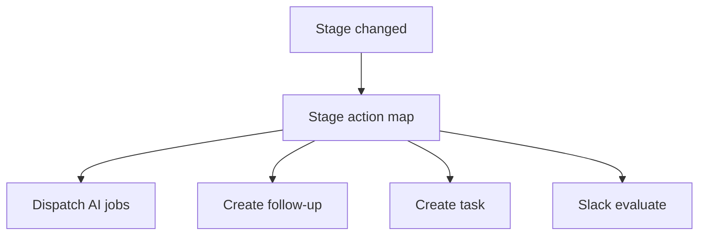

# FDR-014: Pipeline stage-based automation

**Feature:** 14  
**Status:** Approved  
**Reference:** [14 Pipeline stage-based automation](../../05%20-%20Feature%20List.md#f14-pipeline-stage-automation), [ADR-003](../../ADRs/ADR-003-ai-orchestration-architecture.md), [ADR-005](../../ADRs/ADR-005-fixed-sales-pipeline.md), [ADR-018](../../ADRs/ADR-018-proposal-artifact-rendering-and-delivery.md), [ADR-019](../../ADRs/ADR-019-human-controlled-proposal-delivery.md), [13 Proposal assistance](../../05%20-%20Feature%20List.md#f13-proposal-assistance), [20 Proposal artifacts and delivery](../../05%20-%20Feature%20List.md#f20-proposal-artifacts-and-delivery)

---

## Implementation readiness

| Dependency | Status | Impact |
| ---------- | ------ | ------ |
| [FDR-011](../Done/FDR-011-automated-lead-qualification.md) | Done | → Qualification enqueue rules |
| [FDR-013](FDR-013-proposal-assistance.md) | ToDo (Wave 6) | → Proposal Generation dispatches real recommendation |
| [FDR-020](FDR-020-proposal-artifacts-and-delivery.md) | ToDo (Wave 7) | Post-approval artifact jobs may be triggered from domain events this map listens to |

Build this feature in Wave 7 after proposal core and alongside artifacts so Proposal Generation / Analysis / Sent rules are not stubs.

---

## How it works

1. Listen for **`OpportunityStageChanged`** with `from`, `to`, `opportunity_id`.
2. Configurable **stage → actions** map (PHP config class), for example:
   - → **Qualification:** enqueue qualification for **that** opportunity if not already processing/qualified.
   - → **Contact:** optional default follow-up/task template.
   - → **Proposal Generation:** ensure proposal exists; enqueue Proposal Assistant **recommendation** job ([FDR-013](FDR-013-proposal-assistance.md)).
   - → **Proposal Analysis:** human review stage — **do not** auto-send; do not treat entry as autonomous outbound. Optional on-demand insight refresh remains a separate user action ([FDR-012](../Done/FDR-012-ai-recommendations.md)), not an implied send.
   - → **Proposal Sent:** do not send email; send is only via confirmed human action in [FDR-020](FDR-020-proposal-artifacts-and-delivery.md). May record/evaluate reminder hooks for Slack ([FDR-015](FDR-015-slack-notifications.md)).
3. May create **follow-ups** or **tasks** automatically (templates per stage).
4. May notify Slack when action required (delegate to feature 15).
5. **No job chaining** assumption—each action dispatches independent jobs. Idempotent guards prevent duplicate tasks/jobs on repeated identical transitions.

---

## How to test

- Move opportunity to each mapped stage; verify expected side effects (mock AI/email/Slack).
- Idempotent: repeating the same transition does not duplicate follow-ups/tasks.
- Proposal Generation dispatches recommendation job and ensures one proposal row.
- Proposal Analysis / Sent never enqueue client email.
- Invalid or no-op transitions handled gracefully.

---

## Acceptance criteria

- [ ] Central listener registered for stage changes.
- [ ] Stage map covers HLD-critical automations including real Proposal Generation recommendation dispatch.
- [ ] Auto-created follow-ups/tasks link correct entities with idempotency guards.
- [ ] Does not violate [ADR-019](../../ADRs/ADR-019-human-controlled-proposal-delivery.md) for outbound actions.
- [ ] Feature tests per stage rule.

---

## Deployment notes

- Document stage map in config for ops review.
- Requires Horizon/workers for dispatched jobs.
