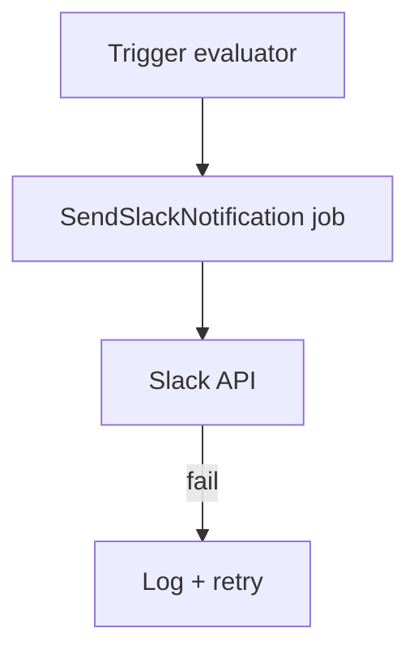

# FDR-015: Slack notifications

**Feature:** 15  
**Status:** Approved  
**Reference:** [15 Slack notifications](../../05%20-%20Feature%20List.md#f15-slack-notifications), [ADR-009](../../ADRs/ADR-009-slack-integration.md), [ADR-012](../../ADRs/ADR-012-integration-failure-isolation.md), [13 Proposal assistance](../../05%20-%20Feature%20List.md#f13-proposal-assistance), [20 Proposal artifacts and delivery](../../05%20-%20Feature%20List.md#f20-proposal-artifacts-and-delivery)

---

## How it works

1. **SlackNotifier** service posts simple text to configured channel (webhook or bot token—choose in implementation).
2. Triggers (MVP):
   - Follow-up due and requires action
   - Important task pending past due
   - Proposal unanswered: opportunity is in **Proposal Sent** beyond a configurable threshold (default documented in deployment notes; env-driven), using stage entry / send confirmation time from proposal delivery
3. Messages include deep link to CRM record (URL from `APP_URL`).
4. Failures logged; queued job retries; CRM transaction not rolled back.

---

## How to test

- Mock Slack HTTP; assert payload for each trigger type.
- Slack down: CRM follow-up still saves.
- Duplicate prevention: same event does not spam channel within cooldown window.
- Proposal reminder uses Proposal Sent timing (not draft/approved-only proposals).

---

## Acceptance criteria

- [ ] Single channel configuration via env/settings.
- [ ] Simple text messages only (no interactive components).
- [ ] Covers PRD notification cases including unanswered sent proposals.
- [ ] Isolated failures per ADR-012.
- [ ] Tests use HTTP fake.

---

## Deployment notes

- Store webhook/token in secrets; configure via `.env`.
- Configure unanswered-proposal threshold via env (for example hours/days since Proposal Sent).
