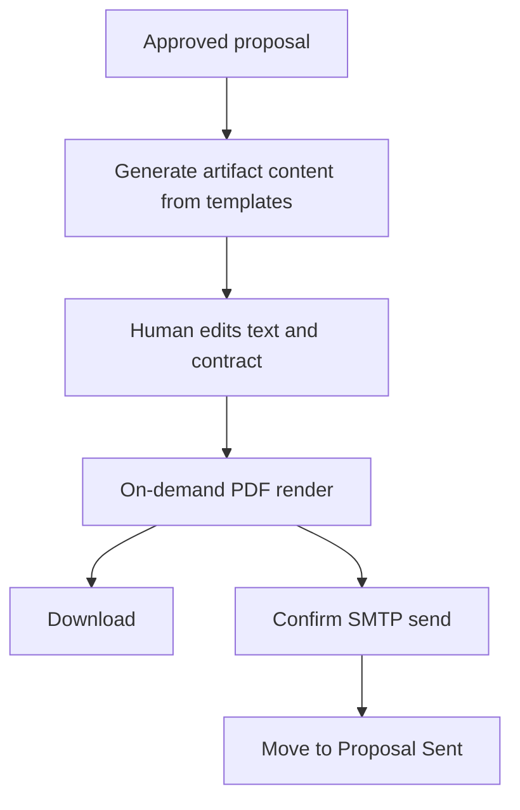

# FDR-020: Proposal artifacts and delivery

**Feature:** 20  
**Status:** Approved  
**Reference:** [20 Proposal artifacts and delivery](../../05%20-%20Feature%20List.md#f20-proposal-artifacts-and-delivery), [ADR-018](../../ADRs/ADR-018-proposal-artifact-rendering-and-delivery.md), [ADR-019](../../ADRs/ADR-019-human-controlled-proposal-delivery.md), [13 Proposal assistance](../../05%20-%20Feature%20List.md#f13-proposal-assistance)

---

## How it works

1. After a proposal is **approved** ([FDR-013](FDR-013-proposal-assistance.md)), queued jobs use **fixed repository templates** to generate:
   - Commercial text (stored editable)
   - Contract text (stored editable)
   - Slide content for PDF-only render
2. Human reviews/edits text and contract in the browser; slide has no in-app slide editor—download PDF only.
3. PDFs for text, slide, and contract are **rendered on demand** from current content (no PDF binary history store).
4. Human may download PDFs and/or open **Send proposal** confirm UI (recipients defaulting to client contact email, editable subject/body, attach generated PDFs).
5. On **successful confirmed send** via Laravel Mail (SMTP; Mailpit locally), move the opportunity to **Proposal Sent**.
6. AI never sends. Failures isolating mail/PDF must not corrupt the proposal record.

---

## How to test

- Unapproved proposal cannot generate/send artifacts.
- Mock LLM/template fill; assert text/contract persisted and labeled as AI-generated in UI where shown.
- PDF endpoints/actions return files for all three artifacts from current content.
- Mail fake: confirm send attaches PDFs and advances stage to Proposal Sent only after success.
- Mail/PDF failure leaves stage unchanged and surfaces user-safe error.
- Browser tests for editor, download, and send confirm (`data-test` selectors).

---

## Acceptance criteria

- [ ] Repository templates for text, slide, and contract.
- [ ] Browser editors for text and contract; slide PDF-only.
- [ ] On-demand PDF generation for all three artifacts.
- [ ] Human download + SMTP send with confirm step.
- [ ] Successful send moves opportunity to Proposal Sent.
- [ ] No autonomous send; tests cover happy path and failure isolation.

---

## Deployment notes

- Configure `MAIL_*` SMTP; use Mailpit in Sail.
- PDF/render job timeouts must exceed generation latency.
- Queue workers/Horizon required.
